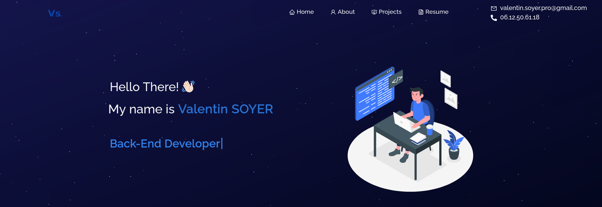

<h2 align="center">
  Portfolio Website 
  <a href="https://valentin-soyer.vercel.app/" target="_blank">Valentin SOYER</a>
</h2>

  

 

<h3 align="center">
    🔹
    <a href="https://github.com/soumyajit4419/Portfolio/issues">Report Bug</a> &nbsp; &nbsp;
</h3>

## Built With

My personal portfolio <a href="https://valentin-soyer.vercel.app/" target="_blank">Valentin SOYER</a> which features some of my github projects as well as my resume and technical skills. 

This portfolio was built using these technologies.

- React.js
- Node.js
- Express.js
- CSS3
- VsCode
- Vercel

## Features

**📖 Multi-Page Layout**

**🎨 Styled with React-Bootstrap and Css with easy to customize colors**

**📱 Fully Responsive**

## 🛠 Installation and Setup Instructions

1. Installation: `npm install`

2. In the project directory, you can run: `npm start`

Runs the app in the development mode.\
Open [http://localhost:3000](http://localhost:3000) to view it in the browser.
The page will reload if you make edits.

## NOTA BENE and Credits

This repository is a fork from [Soumyajit4419](https://github.com/soumyajit4419/Portfolio). If you are interrested by his work, please go to his github page 😁 !
